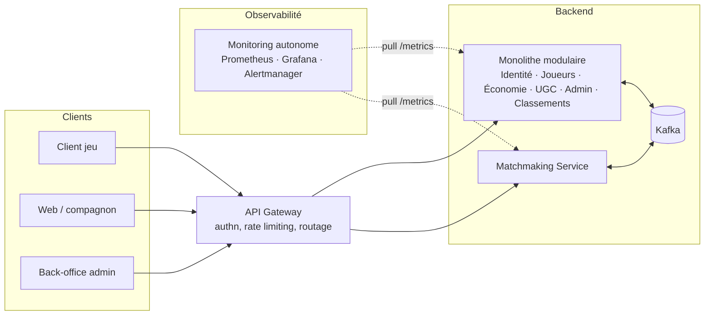
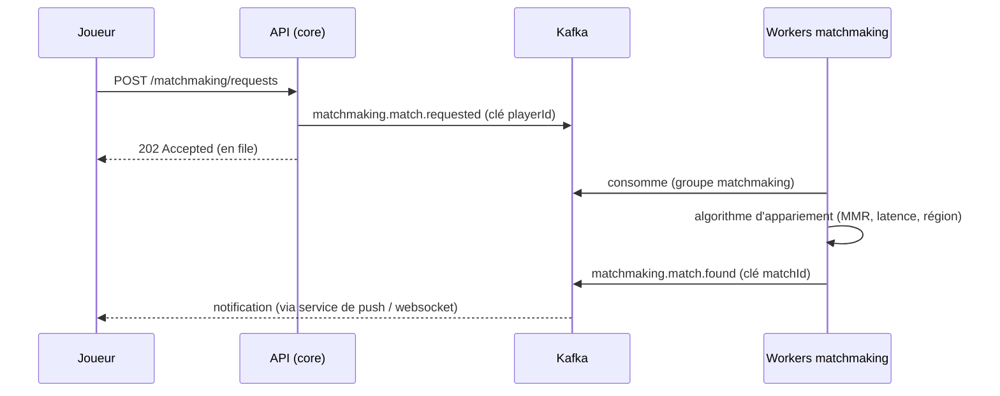
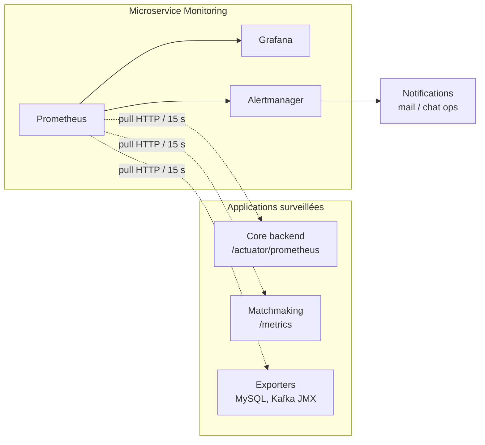

# Architecture Back-End — Plateforme de jeu compétitif en ligne

> Dossier d'architecture répondant aux points 1 à 18 du sujet *Projet d'Architecture Back-End (4j)*.
> Le dépôt `MaDemo` sert de **preuve de concept** : les patterns décrits ici (API REST monitorée, événements Kafka, stack d'observabilité) y sont réellement implémentés à petite échelle.

---

## 1. Vision du projet

Backend de surveillance et de pilotage d'une plateforme de jeu vidéo compétitif en ligne : suivi des joueurs, matchmaking, économie virtuelle, contenu communautaire (UGC) et modération.

Le projet vise la **définition, justification et structuration** d'un backend réaliste, scalable et sécurisé — pas une implémentation exhaustive. La démo `MaDemo` matérialise les briques transverses les plus structurantes : observabilité, messaging, tests de charge.

| Brique du dossier | État dans MaDemo |
|---|---|
| API REST sécurisée (Spring Boot) | ✅ implémentée (`POST /api/profils`) |
| Persistance relationnelle (MySQL) | ✅ implémentée |
| Événements métier (Kafka) | ✅ implémentés (`players.profil.created`, producteur + consommateur) |
| Observabilité (Prometheus + Grafana) | ✅ implémentée (JVM, HTTP, Kafka client) |
| Tests de charge (JMeter + InfluxDB) | ✅ implémentés (load + stress) |
| Alerting (Alertmanager → Discord) | ✅ implémenté (4 règles : AppDown, 5xx, p99, lag Kafka) |
| Domaines métier jeu (matchmaking, économie…) | 📋 conception (ce document) |

---

## 2. Objectifs pédagogiques

Couverts par ce document : conception d'une architecture complexe (§3–5), découpage en domaines (§4), choix de patterns (§8–11), montée en charge (§12), sécurité/robustesse/évolutivité (§10, 15), justification des choix (chaque section argumente ses arbitrages).

---

## 3. Périmètre architectural global

### Type d'architecture : hybride

**Monolithe modulaire** pour le cœur métier + **microservices ciblés** pour les briques qui le justifient :

- **Cœur monolithique modulaire** : domaines Identité, Joueurs, Classements, Économie, UGC, Administration. Un déploiement, des modules aux frontières strictes (packages par domaine, communication interne par événements).
- **Microservice Matchmaking** : besoin de scaling indépendant (pics du soir), algorithme critique à isoler (§8).
- **Microservice Monitoring** : autonome et générique (§18).

**Justification** : une équipe réduite ne tire aucun bénéfice de 7 microservices (complexité opérationnelle, transactions distribuées partout). Le monolithe modulaire garde des transactions ACID locales et un déploiement simple, tout en préparant l'extraction future d'un module (frontières déjà nettes, communication déjà événementielle).

### Flux entrants / sortants

### Temps réel vs différé

| Temps réel (synchrone, < 200 ms) | Différé (asynchrone, événements) |
|---|---|
| Authentification, lecture de profil | Attribution de récompenses |
| Achat en boutique (confirmation immédiate) | Recalcul des classements |
| Demande de matchmaking (accusé de réception) | Modération UGC, statistiques |
| | Appariement effectif (résultat notifié) |

Règle : la requête HTTP ne fait que le strict nécessaire à la réponse ; tout le reste part en événement. Le gameplay temps réel (serveurs de parties) est **hors périmètre** du backend de pilotage.

---

## 4. Découpage par domaines (DDD)

| Domaine | Responsabilités | Données maîtres | Événements publiés |
|---|---|---|---|
| **Identité & Accès** | comptes, sessions, rôles, MFA | credentials, tokens | `identity.account.created` |
| **Joueurs & Profils** | profil, progression, préférences | profils (≈ `Profil` de MaDemo) | `players.profil.created`, `players.profil.updated` |
| **Matchmaking & Compétition** | files d'attente, appariement, matchs | demandes, matchs | `matchmaking.match.requested/found`, `match.result.recorded` |
| **Classements & Progression** | ELO/MMR, ladders, saisons | scores, rangs | `leaderboard.rank.changed` |
| **Économie Virtuelle** | monnaie, boutique, inventaire | soldes, transactions | `economy.transaction.completed` |
| **Contenu Communautaire (UGC)** | skins, replays, commentaires | contenus, métadonnées | `ugc.content.submitted` |
| **Administration & Modération** | sanctions, review UGC, anti-abus | signalements, décisions | `moderation.content.flagged`, `moderation.sanction.applied` |

Chaque domaine possède **ses données** (schéma logique dédié, §7) et n'expose que son API et ses événements. Aucun domaine ne lit les tables d'un autre.

---

## 5. Architecture des services

- **Frontières** : un module/service = un domaine. Le contrat = API REST (synchrone) + événements Kafka (asynchrone). Modèles internes jamais partagés (DTO aux frontières — pattern déjà appliqué dans MaDemo : `Profil` entité vs `ProfilDto`).
- **Communication inter-domaines** : **asynchrone par défaut** (événement Kafka). Synchrone (appel direct) uniquement quand la réponse est nécessaire à la requête en cours (ex. Économie vérifie le solde avant achat). Cela minimise le couplage temporel : un domaine en panne ne bloque pas les autres.
- **Dépendances** : orientées vers les événements, pas vers les services. Le producteur ignore ses consommateurs (démontré dans MaDemo : `ProfilEventProducer` ne connaît pas `ProfilEventConsumer`). Ajout d'un consommateur = zéro modification amont.

---

## 6. Architecture des API

- **Organisation** : REST par ressource, préfixe par domaine — `/api/v1/players/{id}`, `/api/v1/matchmaking/requests`, `/api/v1/economy/wallet`.
- **Versionning** : dans l'URL (`/v1/`). Une montée de version majeure = nouvelle arborescence, l'ancienne maintenue le temps de la migration des clients (jeu déployé chez les joueurs = clients lents à mettre à jour, le versionning est vital).
- **Sécurisation** : gateway unique en entrée — authentification JWT, rate limiting par joueur et par IP, quotas. TLS partout. Détail §10.
- **Cohérence métier côté serveur** : le client (jeu ou web) n'est **jamais** source de vérité. Prix, résultats de match, gains : calculés et validés serveur. Le client envoie des intentions (`acheter item X`), le serveur décide (§11).

---

## 7. Gestion des données

- **Séparation des modèles** : un schéma logique par domaine (`players`, `economy`, …) dans MySQL. Extraction facile en base dédiée si un domaine devient microservice.
- **Choix de persistance** :
  - **MySQL** (implémenté) : données transactionnelles — comptes, soldes, matchs. ACID requis.
  - **Redis** (cible) : cache des classements et sessions — lectures massives, tolérance à une donnée vieille de quelques secondes.
  - **Object storage** (cible) : fichiers UGC (les métadonnées restent en MySQL).
- **Lecture/écriture** : CQRS léger sur les classements — les écritures passent par les événements `match.result.recorded`, un consommateur met à jour une vue de lecture dénormalisée (Redis). L'API de lecture ne touche jamais les tables transactionnelles.
- **Données critiques** (soldes, transactions) : append-only (journal de transactions, jamais d'UPDATE de solde sans ligne de journal), rétention longue, sauvegardes testées.

---

## 8. Matchmaking & calculs sensibles

Position : **microservice dédié**, alimenté par Kafka.

- **Synchrone vs asynchrone** : la demande est acceptée en synchrone (`202`), l'appariement est asynchrone. L'API ne porte jamais le coût de l'algorithme.
- **Isolation** : l'algorithme tourne dans ses propres workers — un bug ou une surcharge n'affecte ni l'API ni les autres domaines. Déploiement et scaling indépendants.
- **Résilience en charge** : le topic absorbe les pics — le **lag devient une file d'attente mesurable** (métrique `records-lag`, déjà visible dans le dashboard Grafana de MaDemo) au lieu d'une saturation de threads HTTP. On scale les workers en fonction du lag.
- **Erreur** : message d'appariement en échec → retries → dead letter topic (§15), le joueur est replacé en file.

---

## 9. Événements & communication interne

### Catalogue des topics (cible)

Convention de nommage : `domaine.entité.action`. La **clé** garantit l'ordre par entité (même clé → même partition → ordre préservé).

| Topic | Clé | Partitions | Rétention | Justification |
|---|---|---|---|---|
| `players.profil.created` | playerId | 3 | 7 j | volume modéré ; ordre par joueur |
| `matchmaking.match.requested` | playerId | 12 | 1 j | fort volume en pic, parallélisme élevé des workers |
| `matchmaking.match.found` | matchId | 6 | 1 j | ordre des événements d'un match |
| `match.result.recorded` | matchId | 6 | 30 j | alimente classements + stats |
| `economy.transaction.completed` | playerId | 6 | 90 j | ordre critique (solde), audit |
| `ugc.content.submitted` | contentId | 3 | 7 j | déclenche la modération |
| `moderation.content.flagged` | contentId | 1 | 30 j | faible volume |
| `<topic>.dlt` | (héritée) | 1 | 14 j | dead letter par topic critique (§15) |

Règles :
- **Réplicas = 3 en production** (cluster 3 brokers : perte d'un broker sans perte de données ni d'écriture, `min.insync.replicas=2`). En dev/démo : 1 (broker unique, cas de MaDemo).
- **Partitions = plafond de parallélisme** d'un groupe de consommateurs. Dimensionner large dès le départ : on peut en ajouter, jamais en retirer.
- Topics **déclarés dans le code** (beans `NewTopic`, pattern `KafkaTopicConfig` de MaDemo) : versionnés, revus en PR, reproductibles.

### Schémas et traçabilité

- **Versionner les schémas d'événements** : suffixe de classe (`ProfilCreatedEventV1`) ou schema registry. Un événement publié est immuable ; un changement incompatible = nouvelle version, les consommateurs migrent à leur rythme.
- **Traçabilité** : chaque événement porte `eventId` (UUID), `occurredAt`, `correlationId` (propagé depuis la requête HTTP d'origine). Le journal Kafka devient une piste d'audit rejouable.

---

## 10. Sécurité backend

- **Authentification** : JWT courts (15 min) + refresh tokens révocables, émis par le domaine Identité. Comptes de service pour les appels inter-services. (MaDemo utilise HTTP Basic + utilisateurs en mémoire — assumé comme raccourci de démo, à remplacer.)
- **Autorisation** : RBAC — rôles `PLAYER`, `MODERATOR`, `ADMIN` — vérifiée à la gateway (gros grain) puis dans chaque service (fin grain, par ressource : un joueur ne lit que *son* inventaire).
- **Flux sensibles** : économie virtuelle = double validation (solde vérifié en transaction, journal append-only), endpoints d'admin sur réseau séparé, secrets hors code (vault / variables d'environnement — les mots de passe en clair du compose de MaDemo sont un raccourci de démo).
- **Abus** : rate limiting à la gateway, détection d'anomalies via les événements (un consommateur anti-fraude écoute `economy.transaction.completed` et `match.result.recorded` — encore un bénéfice du bus d'événements : l'anti-triche s'ajoute sans toucher au code métier).

---

## 11. Cohérence et intégrité métier

- **Serveur autoritaire** : toute règle métier (prix, gains, résultats) est calculée et validée côté serveur ; le client n'envoie que des intentions. Règles non contournables car les API valident systématiquement (Bean Validation en entrée, règles métier en service).
- **Transactions** : ACID à l'intérieur d'un domaine (forces du monolithe modulaire + MySQL). **Jamais de transaction distribuée** entre domaines : cohérence à terme via événements.
- **Problème identifié dans MaDemo — dual-write** : `ProfilService.saveProfil()` écrit MySQL **puis** publie Kafka, sans atomicité. Crash entre les deux = profil en base sans événement émis. Réponse cible : **Outbox pattern** — l'événement est inséré dans une table `outbox` **dans la même transaction MySQL** que le profil ; un relai (poller ou Debezium CDC) publie ensuite vers Kafka. Atomicité garantie, au prix d'une latence de publication de quelques centaines de ms — acceptable pour tous nos flux différés.
- **Prévention des incohérences** : consommateurs **idempotents** (§15) + contraintes d'unicité en base (`eventId` déjà traité = ignoré).

---

## 12. Scalabilité & performances

- **Points critiques identifiés** : matchmaking en pic de soirée (×10), lectures de classements (viral), écritures économie (drops d'objets), base MySQL.
- **Montée en charge** :
  - Services **stateless** (JWT, pas de session serveur) → scaling horizontal derrière la gateway.
  - Workers matchmaking scalés sur le **consumer lag** (métrique déjà collectée dans MaDemo).
  - MySQL : réplicas de lecture pour les domaines à forte lecture ; les vues de lecture (classements) sont dans Redis, pas dans MySQL.
- **Cache** : Redis pour classements et profils publics (TTL courts) ; cache HTTP (ETag) sur les ressources peu changeantes (catalogue boutique).
- **Répartition** : load balancer en amont de la gateway ; partitionnement Kafka par clé pour paralléliser sans casser l'ordre.
- **Validation chiffrée** : les tests JMeter de MaDemo (load 50 VU / stress 10→200 VU) constituent la méthode : chaque hypothèse de charge (§16) est confrontée à un tir de charge, résultats visualisés dans Grafana (InfluxDB) et corrélés aux métriques applicatives (Prometheus).

---

## 13. Observabilité & exploitation

Implémenté dans MaDemo, généralisable tel quel à chaque service :

- **Métriques** : Micrometer expose `/actuator/prometheus` (JVM, HTTP, pool JDBC, clients Kafka). Prometheus scrape toutes les 15 s. Dashboards Grafana provisionnés par fichiers versionnés (JVM, Kafka client, JMeter).
- **Métriques clés suivies** : latence p95/p99 et taux d'erreur HTTP par endpoint, consumer lag par groupe, erreurs de publication Kafka, saturation du pool de connexions, mémoire/GC.
- **Métriques métier** (à ajouter) : compteurs Micrometer (`profils.created.total`, `matches.found.total`, `transactions.amount.sum`) — le fonctionnel devient observable dans les mêmes dashboards.
- **Logs** : logs techniques structurés (JSON) avec `correlationId` propagé jusqu'aux consommateurs Kafka — une action se suit de la requête HTTP à ses effets asynchrones. Logs fonctionnels = événements Kafka eux-mêmes (piste d'audit).
- **Alertes** (implémentées dans MaDemo : `monitoring-service/prometheus/alert-rules.yml`, notifications Discord via Alertmanager) : cible de scrape down (1 min), taux d'erreur 5xx > 1 %, p99 > 1 s, consumer lag Kafka > 100 messages. Chaque règle porte un `for:` qui filtre les pics isolés — on alerte sur les problèmes soutenus, pas sur les blips.

---

## 14. Tests d'architecture

- **Contrats API** : spécification OpenAPI versionnée ; tests de contrat (le client du jeu et le backend valident le même contrat) — casse détectée en CI, pas en production.
- **Intégration inter-services** : Testcontainers (MySQL + Kafka réels dans les tests) — valide la chaîne save → outbox → événement → consommateur.
- **Flux critiques** : scénarios bout-en-bout automatisés sur matchmaking et achat (les deux flux irréversibles).
- **Non-régression** : suite JMeter en CI (déjà en place : workflow GitHub Actions `performance-tests.yml`) — comparaison des percentiles entre versions ; une dégradation de latence est un échec de build.

---

## 15. Sécurité, fiabilité et résilience

- **Erreurs globales** : handler d'exceptions uniforme (problème+détail JSON, jamais de stacktrace au client) ; erreurs asynchrones → retries puis DLT.
- **Sémantique de livraison** : Kafka = **at-least-once** — un message peut être livré deux fois. Réponse : consommateurs **idempotents** (clé `eventId` déjà traité → skip). Jamais supposer exactly-once.
- **Retries + Dead Letter Topic** : échec de traitement → 3 tentatives avec backoff → message poussé sur `<topic>.dlt` avec l'erreur en en-tête. La file principale n'est jamais bloquée ; les DLT sont monitorés (alerte si > 0) et rejouables après correctif.
- **Tolérance aux pannes** : Kafka down → l'API continue (publication asynchrone non bloquante, déjà le comportement de `ProfilEventProducer` dans MaDemo) et l'outbox garde les événements en attente ; MySQL down → circuit breaker, réponse dégradée ; un consommateur down → les messages s'accumulent (lag) et sont traités au retour — **aucune perte**.
- **Reprise sur incident** : les événements étant persistés dans Kafka (rétention), un consommateur corrigé **rejoue** depuis son dernier offset. Le monitoring (§18) est le premier outil de diagnostic.
- **Continuité** : déploiements progressifs (rolling), healthchecks (pattern déjà en place dans le compose : MySQL et Kafka conditionnent le démarrage de l'app).

---

## 16. Contraintes réalistes & hypothèses

| Hypothèse | Valeur retenue | Conséquence architecturale |
|---|---|---|
| Joueurs actifs/jour | 50 000 | monolithe modulaire suffisant pour le cœur |
| Connectés simultanés (pic 19h–23h) | 5 000, pics ×10 sur événements | matchmaking en microservice + file Kafka |
| Demandes de matchmaking en pic | ~200/s | 12 partitions, workers scalables |
| Transactions économie | ~50/s | MySQL + journal append-only tient la charge |
| Lecture classements | ~2 000/s | cache Redis obligatoire, pas de lecture SQL directe |
| Budget/équipe | petite équipe, coûts contenus | pas de microservices systématiques, pas de multi-région v1 |

**Arbitrages coûts/complexité assumés** : monolithe modulaire plutôt que microservices partout (coût opérationnel), cohérence à terme plutôt que transactions distribuées (complexité), un seul cluster Kafka mutualisé, monitoring mutualisé (§18).

---

## 17. Livrables

- Schéma d'architecture global : §3
- Description des domaines et services : §4–5
- Diagrammes de flux et de séquence : §3, §8, §18
- Justification des choix : dans chaque section
- Support d'oral : ce document + démo live `MaDemo` (POST → événement Kafka visible dans AKHQ → métriques dans Grafana → arrêt de l'app ou stress test → alerte Discord en direct)

---

## 18. Option : microservice de monitoring autonome

**Choix retenu et implémenté** — la stack Prometheus/Grafana/Alertmanager de `MaDemo` **est** ce microservice.

### Justification de la séparation

- Le monitoring a un cycle de vie, un rythme de déploiement et des besoins de ressources sans rapport avec le métier ; le coupler au backend imposerait de redéployer la surveillance à chaque release du jeu.
- Dans l'architecture hybride (§3), c'est la brique la plus naturellement microservice : aucune donnée métier, aucun couplage transactionnel, un contrat unique (format OpenMetrics).

### Indépendance vis-à-vis des applications surveillées

- **Générique** : Prometheus scrape n'importe quelle cible exposant `/metrics` (app Spring, service Go, base via exporter…). Ajouter une cible = une ligne dans `prometheus.yml` — zéro modification de l'application. Démontré dans MaDemo : l'app ignore totalement l'existence de Prometheus.
- **Non intrusif** : modèle **pull** — l'application expose passivement un endpoint ; elle n'a ni l'adresse du monitoring, ni de connexion à gérer, ni de logique d'envoi. Panne, surcharge ou déploiement raté du monitoring = **zéro impact** sur l'application surveillée (le scrape échoue côté Prometheus, c'est tout).
- Ce point a été confronté à l'alternative « pousser les métriques via Kafka » et l'alternative a été rejetée : elle inverserait la dépendance (l'app devrait connaître le broker et gérer l'envoi), créerait une dépendance circulaire (surveiller Kafka via Kafka) et exigerait un composant custom Kafka→Prometheus. Le pull est plus simple **et** plus isolant.

### Responsabilités

| Responsabilité | Réalisation |
|---|---|
| Collecte de métriques | Prometheus, scrape 15 s, format OpenMetrics |
| Seuils et alertes | règles Prometheus + Alertmanager → Discord (latence p99, 5xx, lag Kafka, cible down) |
| Tableaux de bord | Grafana, dashboards versionnés et provisionnés automatiquement |
| Résultats de tests de charge | InfluxDB + JMeter (chaîne dédiée, même Grafana) |

### Résilience et robustesse du microservice

- **Tolérance aux pannes** : containers redémarrés automatiquement (`restart`), base time-series persistée en volume (`prometheus_data`) — un crash ne perd pas l'historique ; la configuration étant 100 % fichiers versionnés, le service se reconstruit à l'identique (`docker compose up`).
- **Charge maîtrisée sur les applications** : intervalle de scrape fixe (15 s) et timeout par cible — le monitoring ne peut pas générer de surcharge, contrairement à un modèle push où une app en pointe inonde le collecteur.
- Panne du monitoring = perte temporaire de visibilité, jamais de dégradation du service surveillé — le mode de défaillance est **asymétrique par conception**.

### Intégration dans l'architecture globale

**Flux de données** : métriques numériques agrégées (compteurs, jauges, histogrammes), tirées en HTTP toutes les 15 s, format OpenMetrics. Aucune donnée métier ne transite — le monitoring voit « combien/à quelle vitesse », jamais « qui/quoi » (séparation nette avec les événements Kafka, qui portent le fait métier).

### Bénéfices

- **Sécurité** : surface minimale (lecture seule d'endpoints métriques), pas d'accès aux données métier.
- **Fiabilité** : défaillance asymétrique ; historique persisté ; configuration reproductible.
- **Exploitation** : un point unique d'observation pour N applications ; dashboards et alertes versionnés en Git.
- **Évolutivité** : nouvelle application = un endpoint à exposer + une cible à déclarer. La brique est réutilisable telle quelle pour tout autre projet.
